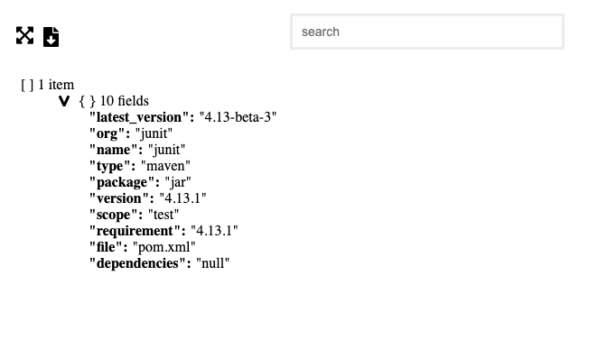
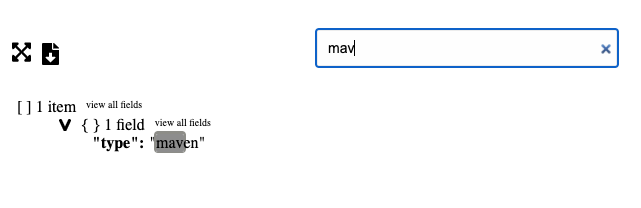

# react-data-explorer

ReactDataExplorer is a simple component, intended to be used in a react app, that will render json in a way that makes exploring that json easy.

install:
`npm i @nathan-j-brenner/react-data-explorer`

example:

```javaScript
import ReactDataExplorer from '@nathan-j-brenner/react-data-explorer'

function App() {
  const data = [    {
      latest_version: '4.13-beta-3',
      org: 'junit',
      name: 'junit',
      type: 'maven',
      package: 'jar',
      version: '4.13.1',
      scope: 'test',
      requirement: '4.13.1',
      file: 'pom.xml',
      dependencies: null,
    }]
  return <ReactDataExplorer data={data}>
}
```

This component takes a single prop, `data`, that can take an object, array, or json.

The component loads with the first level of the tree rendered:


You can click on the arrows to toggle the depths of the tree



or you can toggle the entire tree to open or collapse from clicking on this icon:


You can also search by key or value. Where your query matches a node in the tree, the text will be highlighted. None of the rest of the leaves at that branch will render, and the path to that node will render.



You can also click on this icon to download the raw data into a json file:


This project was strongly influenced by several similar open sourced projects, specifically [react-json-inspector](https://www.npmjs.com/package/react-json-inspector) and [react-json-tree](https://www.npmjs.com/package/react-json-tree). At the time of writing this, I couldn't find any react component that would render data in a way that would be collapsable, worked with search, and was written based off of functional components and hooks.

Roadmap:

- enable greater flexibility around areas like styling (specifically providing ways to render with css-in-js or the opposite)
- make search, export, and expand optional
- optimize search and expand. Expand all will come with a performance price. The bigger your data, the longer your data will take to render.
